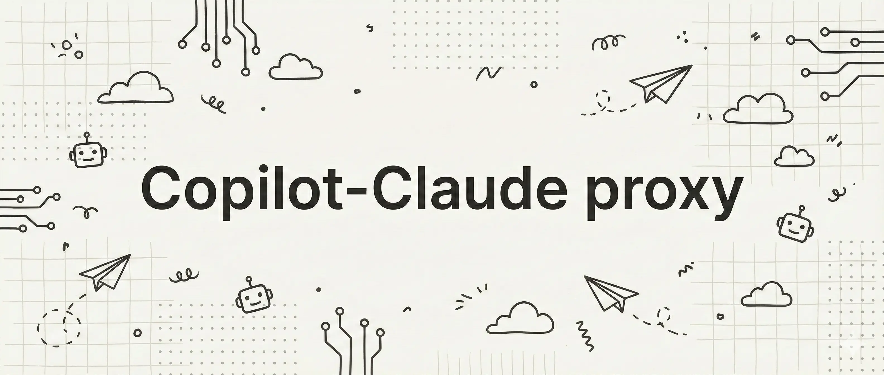

<picture>
	<source media="(prefers-color-scheme: dark)" srcset=".github/banner-dark.webp" />
	
</picture>

---

A small HTTP proxy that exposes a Claude/Anthropic-compatible API surface on top of the GitHub Copilot CLI (via `@github/copilot-sdk`).

This is useful when you have a Claude-compatible client but want requests to be fulfilled by Copilot.

## Requirements

- **Bun**
- **GitHub Copilot CLI** installed and available as `copilot` in your `PATH` (or configure `COPILOT_CLI_PATH`)
- A GitHub account with Copilot access (either logged-in CLI user or a token via `COPILOT_GITHUB_TOKEN`)

## Getting Started

Install dependencies:

```bash
bun install
```

Create a `.env` at the repo root (minimum required is `CORS_ORIGIN`):

```bash
# Required
CORS_ORIGIN=http://localhost:3000

# Optional
COPILOT_MODEL=claude-sonnet-4.5
COPILOT_USE_LOGGED_IN_USER=true

# If the `copilot` binary is not on PATH
# COPILOT_CLI_PATH=/absolute/path/to/copilot

# If connecting to an already-running Copilot CLI server
# COPILOT_CLI_URL=http://127.0.0.1:8080

# If not using the logged-in user
# COPILOT_GITHUB_TOKEN=ghp_...
```

Run the API:

```bash
bun run dev:server
```

Or run via CLI:

```bash
# After `bun install`, the bin is available in the workspace
bunx copilot-claude-proxy start --cors-origin http://localhost:3000

# You can also configure via env
# CORS_ORIGIN=http://localhost:3000 bunx copilot-claude-proxy start
```

The API defaults to `http://localhost:3000`.

### CLI options

The `start` command supports:

- `--host` (env: `HOST`, default: `localhost`)
- `--port` (env: `PORT`, default: `3000`)
- `--cors-origin` (env: `CORS_ORIGIN`, required)

Smoke test:

```bash
bun run --filter server smoke
```

CLI smoke test:

```bash
bun run smoke:cli
```

## Claude API Compatibility

Base URL: `http://localhost:3000`

### Supported endpoints

- `GET /` (health check) → `OK`
- `GET /v1/models` (lists available Copilot-backed models)
- `POST /v1/messages` (Claude Messages API – partial)
	- Supports: `messages`, `max_tokens`, `stream`, `system`, `model`
	- `messages[].content` supports either a plain string or an array of `{ type: "text", text: string }` blocks
	- Streaming: returns `text/event-stream` with `message_start`, `content_block_delta`, `message_stop` (and `error` on failure)

### Unsupported endpoints

Everything not listed above is currently unsupported, including (non-exhaustive):

- `POST /v1/complete`
- `POST /v1/messages/count_tokens`
- `POST /v1/messages/batches` (and related batch endpoints)
- Files API, beta endpoints, admin endpoints

### Unsupported `/v1/messages` features

The proxy will reject tool-related fields:

- `tools`
- `tool_choice`
- `tool`
- `tool_results`

Other Claude/Anthropic request fields may be accepted but are ignored by the proxy implementation.

## Project Structure

```
copilot-claude-proxy/
├── apps/
│   ├── cli/               # CLI entrypoint (`copilot-claude-proxy`)
│   └── server/            # Hono API (Claude-compatible routes)
├── packages/
│   ├── env/               # Runtime env parsing/validation
│   └── config/            # Shared tooling config (Ultracite/Biome)
└── openspec/              # Design + archived change artifacts
```

## Scripts

- `bun run dev`: Start all apps in development mode (turbo)
- `bun run dev:cli`: Run the CLI in dev mode
- `bun run dev:server`: Start only the API server
- `bun run smoke:cli`: Smoke test the CLI
- `bun run build`: Build all apps
- `bun run check-types`: Typecheck across the monorepo
- `bun run check`: Lint/check via Ultracite
- `bun run fix`: Auto-fix via Ultracite
